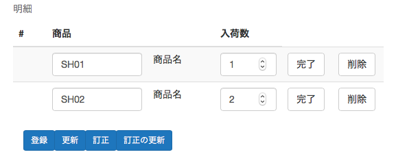
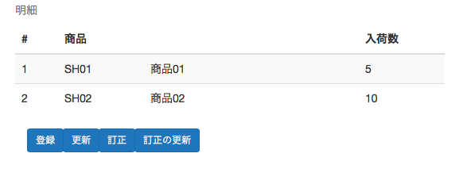
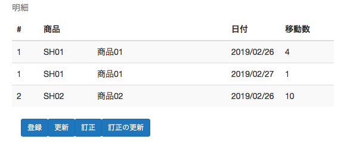
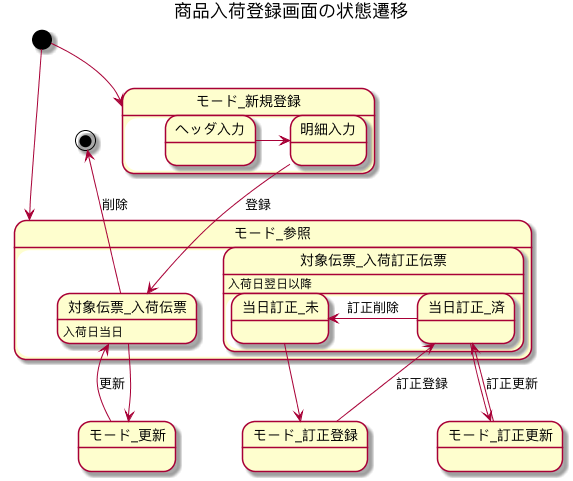
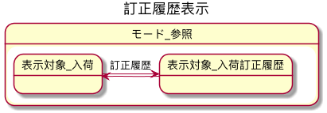

# 商品入荷画面項目定義

## 画面レイアウト

### 全体

### 明細リスト

#### 入荷（登録・更新時）

#### 入荷（参照時）

#### 入荷訂正履歴（参照時）

## 画面状態遷移図

### 全体

### 参照モード時の訂正履歴表示切替

## 画面項目定義

### ヘッダ

- 入力可能条件:モード=新規登録

#### 部署コード

- クラス:部署コード
- 必須:true
- 表示条件:常
- 入力可能条件:ヘッダ入力=可

#### 入荷先コード

- クラス:入荷先コード
- 必須:true
- 表示条件:常
- 入力可能条件:ヘッダ入力=可

#### 入荷日

- クラス:日付
- 必須:-
- 表示条件:常
- 入力可能条件:不可

### 明細リスト_入荷

- 表示条件:表示対象=入荷
- 入力可能条件:モード=新規登録or更新or訂正登録or訂正更新

#### 商品コード

- クラス:商品コード
- 必須:true
- 表示条件:-
- 入力可能条件:明細入力=可

#### 商品名

- クラス:-
- 必須:-
- 表示条件:-
- 入力可能条件:不可

#### 入荷数

- クラス:整数
- 必須:true
- 表示条件:-
- 入力可能条件:明細入力=可

### 明細リスト_入荷訂正履歴

- 表示条件:モード=参照 & 表示対象=入荷訂正履歴
- 入力可能条件:不可

#### 商品コード

- クラス:-
- 必須:-
- 入力可能条件:-
- 入力可能条件:-

#### 商品名

- クラス:-
- 必須:-
- 表示条件:-
- 入力可能条件:-

#### 日付

- クラス:-
- 必須:-
- 表示条件:-
- 入力可能条件:-

#### 移動数

- クラス:-
- 必須:-
- 表示条件:-
- 入力可能条件:-

### ボタン

#### 登録

- 処理:登録
- 表示条件:モード=新規登録

#### 更新

- 処理:更新
- 表示条件:モード=更新

#### 削除

- 処理:削除
- 表示条件:モード=参照 & 対象伝票=入荷伝票

***

#### 訂正

- 処理:訂正登録
- 表示条件:モード=訂正登録

#### 訂正更新

- 処理:訂正更新
- 表示条件:モード=訂正更新

#### 訂正削除

- 処理:訂正削除
- 表示条件:モード=参照 & 対象伝票=入荷訂正伝票 & 当日訂正=済

***

#### 参照モード

- 処理:参照モード表示
- 表示条件:モード=更新or訂正登録or訂正更新

#### 更新モード

- 処理:更新モード表示
- 表示条件:モード=参照 & 対象伝票=入荷伝票

#### 訂正モード

- 処理:訂正登録モード表示
- 表示条件:モード=参照 & 対象伝票=入荷訂正伝票 & 当日訂正=未

#### 訂正更新モード

- 処理:訂正更新モード表示
- 表示条件:モード=参照 & 対象伝票=入荷訂正伝票 & 当日訂正=済

***

#### ヘッダ入力完了

- 処理:ヘッダ整合性検証 
- 表示条件:モード=ヘッダ入力=可

#### 明細入力完了

- 処理:明細整合性検証
- 表示条件:明細入力=可

***

#### 訂正履歴

- 処理:訂正履歴表示切替
- 表示条件:モード=参照
- 補足:明細リストの表示内容（入荷or入荷訂正履歴）を切り替える。
