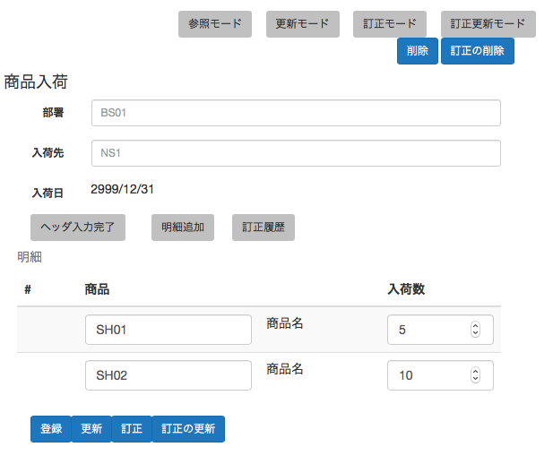

# 商品入荷画面項目定義

## 画面レイアウト

### 基本レイアウト

### 明細レイアウト

#### 明細登録時

#### 参照時

#### 訂正参照時

## 画面状態遷移図

## 画面項目定義

### 入力項目・表示項目

#### 部署コード

- クラス:部署コード
- 必須:true
- 表示条件:常
- 入力可能条件:ヘッダ入力

#### 入荷先コード

- クラス:入荷先コード
- 必須:true
- 表示条件:常
- 入力可能条件:ヘッダ入力

#### 入荷日

- クラス:日付
- 表示条件:常
- 入力可能条件:なし

#### 商品コード

- クラス:商品コード
- 必須:true
- 表示条件:常
- 入力可能条件:明細入力

#### 入荷数

- クラス:整数
- 必須:true
- 表示条件:訂正履歴非表示
- 入力可能条件:明細入力

#### 訂正数

- クラス:整数
- 必須:true
- 表示条件:参照モード&訂正履歴表示
- 入力可能条件:なし

### ボタン

#### 登録

- 処理仕様:登録
- 押下可能条件:新規登録モード

#### 更新

- 処理仕様:更新
- 押下可能条件:更新モード

#### 削除

- 処理仕様:更新
- 押下可能条件:参照モード&更新可能

#### 訂正

- 処理仕様:訂正登録
- 押下可能条件:訂正登録モード

#### 訂正更新

- 処理仕様:訂正更新
- 押下可能条件:訂正更新モード

#### 参照モード

- 処理仕様:参照モード表示
- 押下可能条件:更新モードor訂正登録モードor訂正更新モード

#### 更新モード

- 処理仕様:更新モード表示
- 押下可能条件:参照モード&更新可能

#### 訂正モード

- 処理仕様:参照モード表示
- 押下可能条件:参照モード&訂正可能&当日未訂正

#### 訂正更新モード

- 処理仕様:参照モード表示
- 押下可能条件:参照モード&訂正可能&当日訂正済
